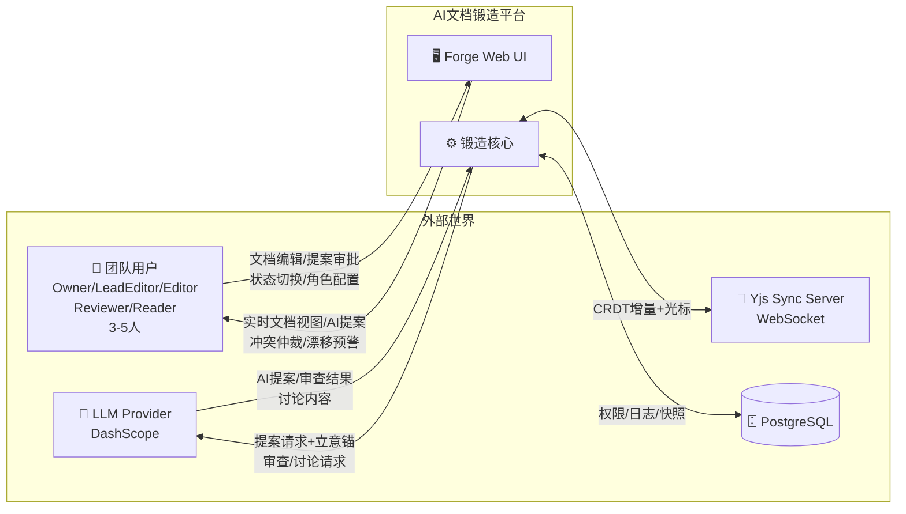
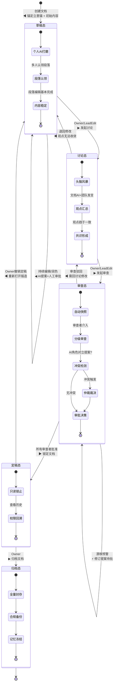
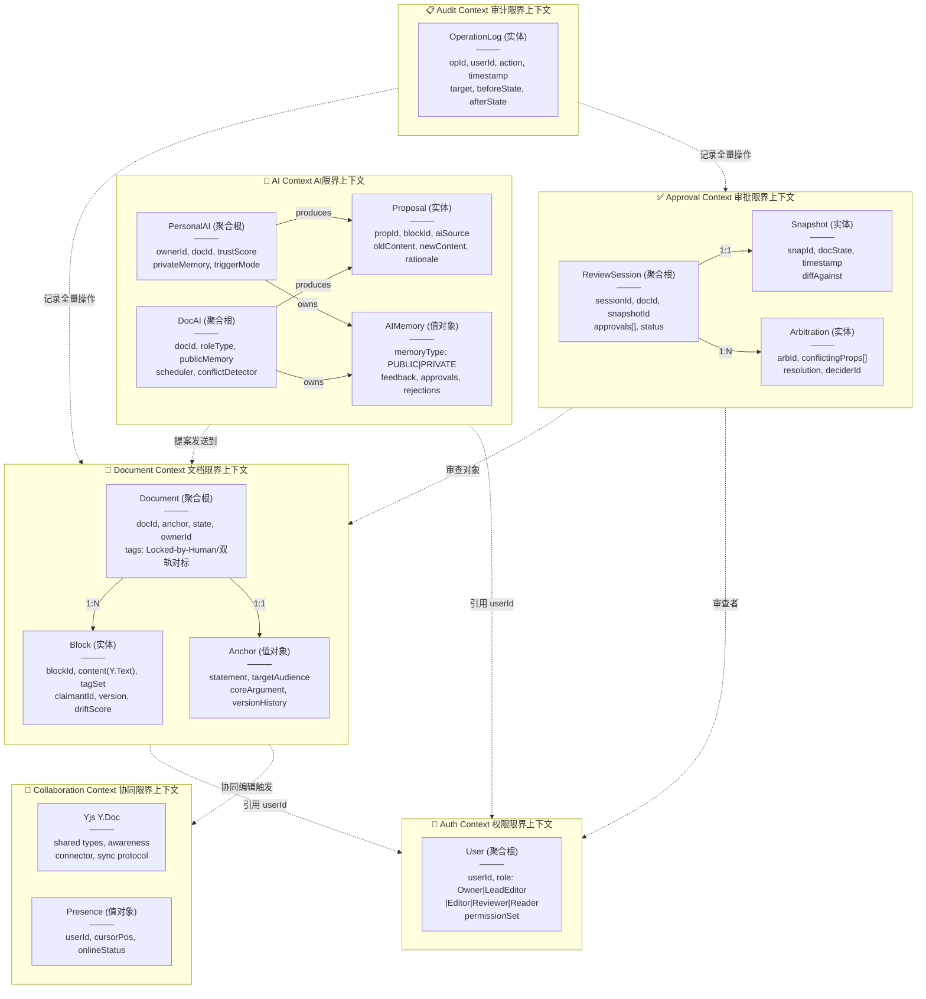
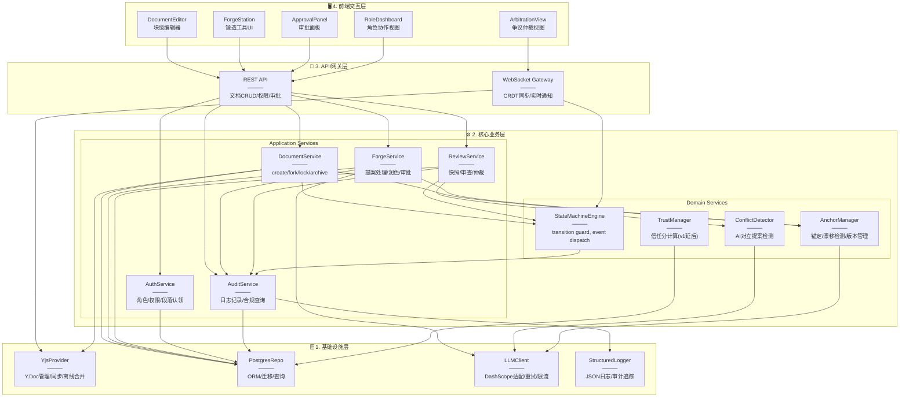
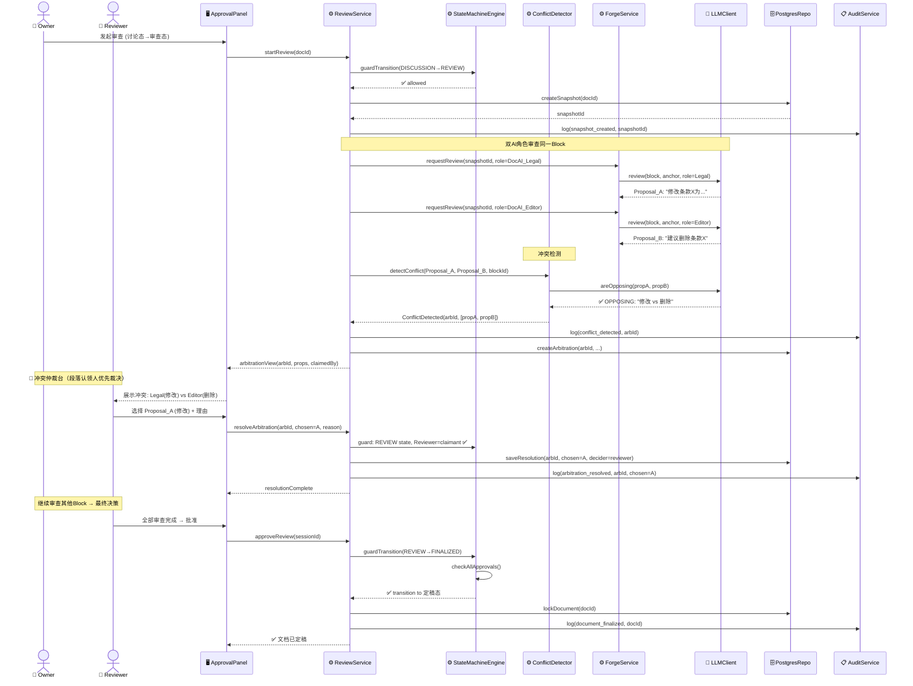
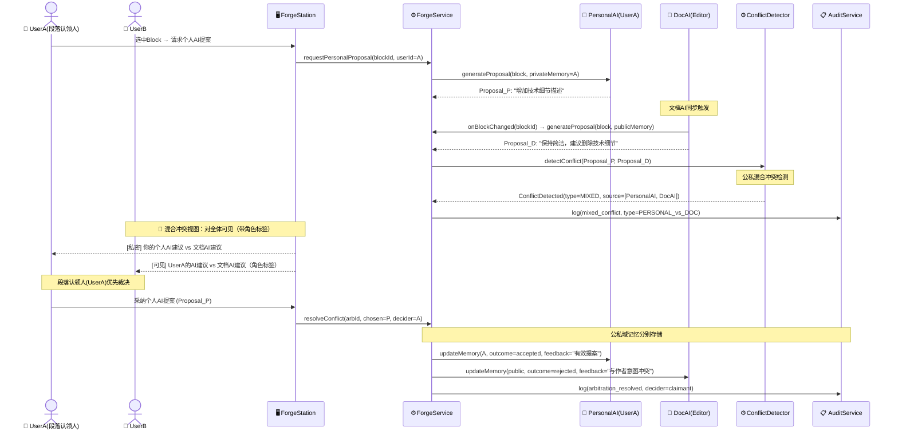

# AI文档锻造平台 — 设计报告

> 项目: ai-collab-docs | DNA: 规则密集型+实时协同+DDD | MVP: 3-5人团队

---

## ADR-000: 项目DNA判定

- **状态**: accepted
- **日期**: 2026-06-09
- **背景**: 基于PRD+ga.md需求信号检测项目特征
- **决策**: 判定为 rule_intensive+realtime+ddd 复合型
- **备选方案**: 纯CRUD系统（排除：状态机复杂度高，非简单增删改查）| 纯事件驱动（排除：规则约束是核心而非事件）
- **后果**:
  - 正面: 四维建模全覆盖，规则/结构/行为/边界完整
  - 负面: 图序列较长(6图)，设计阶段耗时增加
  - 约束: 必须定义状态机transition表、DDD聚合边界、组件依赖方向
- **推荐图序列**: Context(边界) → StateMachine(约束) → DDD聚合(结构) → Component(结构) → Sequence(行为) → Activity(行为)

> **2026-06-18 更新**: 平台已从Web端转向 **Tauri v2 桌面客户端**（ADR-010）。UI交互层由浏览器迁移至系统WebView + Rust原生壳。DDD聚合/状态机/序列图/活动图不受影响，Component图的L4层模块重新定义为桌面端组件。

---

## Round 1: Context Diagram (维度A — 边界与交互)

### 发现率: 16 新实体 (6概念 + 8流 + 2约束)



### 发现的实体

| 实体ID | 名称 | 类型 | 来源 |
|--------|------|------|------|
| c1 | Forge Platform | external_system | PRD二、四层架构 |
| c2 | TeamUser | actor | PRD模块六、五级权限 |
| c3 | LLM Provider | external_system | ga.md技术选型 |
| c4 | Yjs Sync Server | external_system | ga.md技术选型 |
| c5 | PostgreSQL | data_store | ga.md技术选型 |
| c6 | Forge Web UI | external_system | PRD二、4.前端交互层 |

### 发现的数据流

| 流ID | 方向 | 内容 | 来源 |
|------|------|------|------|
| f1 | User→UI | 编辑/审批/状态切换 | PRD模块三 |
| f2 | UI→User | 实时视图/提案/仲裁 | PRD模块三:3.3 |
| f3 | Core→LLM | 提案请求+锚 | PRD模块二 |
| f4 | LLM→Core | AI提案/审查/讨论 | PRD模块三:3.1 |
| f5 | Core→Yjs | CRDT增量 | PRD模块一 |
| f6 | Yjs→Core | 合并后状态 | PRD模块一 |
| f7 | Core→PG | 权限/日志/快照 | PRD四 |
| f8 | PG→Core | 权限查询/日志 | PRD六 |

### 发现的约束

| 约束ID | 内容 | 来源 |
|--------|------|------|
| ct1 | AI零直改权限 | PRD底线规则#1 |
| ct2 | 人类最高主权 | PRD底线规则#2 |

### 交叉检查

首图，无交叉检查目标。下轮 Context vs StateMachine 开始交叉。

---


---

## Round 2: State Machine Diagram (维度B — 约束与规则)

### 发现率: 9 新实体 (1概念 + 5状态 + 3约束) | 交叉检查Context: 0遗漏



### 状态定义

| 状态ID | 名称 | 进入条件 | 退出条件 | 允许操作 |
|--------|------|---------|---------|---------|
| s1 | 草稿态 | 创建文档 + 锚定立意锚 | 发起讨论/持续编辑 | AI提案/审批/段落认领/编辑 |
| s2 | 讨论态 | Owner/LeadEdit发起 | 发起审查/退回修改 | 文档AI发言/团队讨论/观点标注 |
| s3 | 审查态 | Owner/LeadEdit发起审查 | 全审通过/审查驳回 | 快照/审查/冲突仲裁/提案审批 |
| s4 | 定稿态 | 所有审查者批准 | 撤销/归档 | 只读/历史查看/权限回溯 |
| s5 | 归档态 | Owner归档 | — | 只读/备份/导出 |

### Transition权限矩阵

| Transition | Owner | LeadEdit | Editor | Reviewer | Reader |
|------------|-------|----------|--------|----------|--------|
| 创建→草稿 | ✅ | ✅ | ✅ | — | — |
| 草稿→讨论 | ✅ | ✅ | ❌ | ❌ | ❌ |
| 讨论→审查 | ✅ | ✅ | ❌ | ❌ | ❌ |
| 讨论→草稿 | ✅ | ✅ | ❌ | ❌ | ❌ |
| 审查→定稿 | ✅ | ✅(after all approved) | ❌ | ✅(own approval) | ❌ |
| 审查→讨论 | ✅ | ✅ | ❌ | ❌ | ❌ |
| 定稿→草稿 | ✅ | ❌ | ❌ | ❌ | ❌ |
| 定稿→归档 | ✅ | ❌ | ❌ | ❌ | ❌ |

### 新发现实体

| 实体ID | 名称 | 类型 | 来源 | 交叉验证 |
|--------|------|------|------|---------|
| c7 | Document | aggregate_root | 状态机构建 | ✅ Context中f1隐含 |
| s1 | 草稿态 | state | PRD六、全链路 | ✅ |
| s2 | 讨论态 | state | PRD六、全链路 | ✅ |
| s3 | 审查态 | state | PRD六、全链路 | ✅ |
| s4 | 定稿态 | state | PRD六、全链路 | ✅ |
| s5 | 归档态 | state | PRD六、全链路 | ✅ |
| ct3 | 状态锁止规则 | constraint | PRD底线规则#3 | ✅ ct2相关 |
| ct4 | 操作全量日志 | constraint | PRD底线规则#4 | — 新发现 |
| ct5 | 防拉扯机制 | constraint | PRD底线规则#5 | — 新发现 |

### 交叉检查：Context图 vs StateMachine

| 检查项 | Context中提及 | StateMachine对应 | 状态 |
|--------|-------------|-----------------|------|
| f1: 状态切换 | ✅ | Transition表完整覆盖 | ✅ |
| ct2: 人类最高主权 | ✅ | Transition权限矩阵体现 | ✅ |
| 审查态→定稿的审批闭环 | — | s3→s4 所有审查者批准 | ✅ |
| 讨论态AI发言 | — | s2: 文档AI+团队讨论 | ✅ |
| 归档态记忆冻结 | — | s5: 记忆冻结 | ✅ |

**交叉检查结论**: Context图数据流f1/f2覆盖了状态切换的用户交互，StateMachine补充了5个具体状态+3个新约束（状态锁止/全量日志/防拉扯）。无遗漏。


---

## Round 3: DDD Aggregate Diagram (维度C — 静态结构)

### 发现率: 14 新实体 (6限界上下文 + 4聚合根 + 7实体/值对象) | 交叉检查StateMachine: 0遗漏



### 限界上下文定义

| BC ID | 名称 | 核心职责 | 聚合根 | 关键不变量 |
|-------|------|---------|--------|-----------|
| BC1 | Document | 文档内容管理、标签、立意锚 | Document | Anchor不可被AI修改 |
| BC2 | Collaboration | 实时协同CRDT同步 | Y.Doc(外部) | 所有Block变更经Yjs CRDT |
| BC3 | AI | AI角色、提案、记忆管理 | PersonalAI, DocAI | 公私AI记忆完全隔离 |
| BC4 | Approval | 审查、快照、仲裁 | ReviewSession | 审查基于快照，非实时文档 |
| BC5 | Auth | 用户、角色、权限 | User | 权限更改需Owner确认 |
| BC6 | Audit | 操作日志、合规追溯 | OperationLog | 日志不可删除不可篡改 |

### 新发现实体

| 实体ID | 名称 | 类型 | 所属BC | 来源 | 交叉验证 |
|--------|------|------|--------|------|---------|
| BC1 | Document Context | bounded_context | — | DDD建模 | — |
| BC2 | Collaboration Context | bounded_context | — | DDD建模 | — |
| BC3 | AI Context | bounded_context | — | DDD建模 | — |
| BC4 | Approval Context | bounded_context | — | DDD建模 | — |
| BC5 | Auth Context | bounded_context | — | DDD建模 | — |
| BC6 | Audit Context | bounded_context | — | DDD建模 | — |
| c8 | Document | aggregate_root | BC1 | PRD模块一/二 | ✅ s1-s5引用 |
| c9 | Block | entity | BC1 | PRD模块一 | ✅ 状态机编辑行为依赖 |
| c10 | Anchor | value_object | BC1 | PRD模块二 | ✅ 草稿创建时锚定 |
| c11 | PersonalAI | aggregate_root | BC3 | PRD模块三 | ✅ 草稿态个人AI打磨 |
| c12 | DocAI | aggregate_root | BC3 | PRD模块三:3.2 | ✅ 讨论态文档AI发言 |
| c13 | Proposal | entity | BC3 | PRD模块三:3.1 | ✅ 审查态提案审批 |
| c14 | ReviewSession | aggregate_root | BC4 | PRD模块四 | ✅ 审查态快照+审查 |
| c15 | User | aggregate_root | BC5 | PRD模块六 | ✅ Transition权限矩阵 |
| c16 | OperationLog | entity | BC6 | PRD四 | ✅ ct4全量日志 |
| c17 | AIMemory | value_object | BC3 | PRD模块三 | ✅ 公私域记忆隔离 |
| c18 | Snapshot | entity | BC4 | PRD模块四 | ✅ s3审查态自动快照 |
| c19 | Arbitration | entity | BC4 | PRD模块三:3.3 | ✅ s3冲突仲裁 |
| c20 | Presence | value_object | BC2 | PRD模块一 | — 新发现 |

### 交叉检查：StateMachine vs DDD

| 检查项 | StateMachine | DDD对应 | 状态 |
|--------|-------------|---------|------|
| s1草稿态: 段落认领 | Block.claimantId | ✅ Block实体 | ✅ |
| s2讨论态: AI发言 | DocAI.publicMemory | ✅ DocAI聚合根 | ✅ |
| s3审查态: 快照 | Snapshot实体 | ✅ ReviewSession | ✅ |
| s3审查态: 冲突仲裁 | Arbitration实体 | ✅ BC4 | ✅ |
| 所有状态: 操作日志 | OperationLog | ✅ BC6 | ✅ |
| 权限控制 | Transition权限矩阵 | ✅ BC5 User.role | ✅ |
| 立意锚不可修改性 | 锚定于创建 | ✅ Anchor.valueObject | ✅ |

**交叉检查结论**: DDD补充了6个限界上下文+6个聚合根/实体，所有StateMachine状态在DDD中找到对应的聚合/实体支撑。无遗漏。公私AI记忆隔离（AIMemory.public|private）是本次重要新发现。


---

## Round 4: Component Diagram (维度C — 模块架构与依赖方向)

### 发现率: 5 新实体 (10模块 + 2新增概念) | 交叉检查DDD: 0遗漏



### 模块定义与依赖规则

| 层 | 模块 | 核心职责 | 仅依赖 | DDD BC映射 |
|----|------|---------|--------|-----------|
| L4 桌面端 | DocumentEditor | Yjs块级协同编辑（Tauri WebView内） | IPC→Rust/Yjs WS | BC1+BC2 |
| L4 桌面端 | ForgeStation | 润色台/提案Diff/AI交互 | IPC→Rust/HTTP | BC3 |
| L4 桌面端 | ArbitrationView | 冲突仲裁可视化（可弹出独立窗口） | IPC→Rust/WS | BC4 |
| L4 桌面端 | ApprovalPanel | 审批三选项/决策面板 | IPC→Rust/HTTP | BC4 |
| L4 桌面端 | RoleDashboard | 角色管理/权限/认领视图 | IPC→Rust/HTTP | BC5 |
|| Rust 模块 (L4 Tauri) | 8模块（ADR-011） | 仅依赖 | BC映射 |
|| Rust ipc/ | IPC通信层：命令路由/事件发射 | collab/ rule_gateway/ fs/ offline/ ai_scheduler/ | — |
|| Rust collab/ | 协同数据：Yjs bridge + awareness | ipc/ | BC2 |
|| Rust rule_gateway/ | 规则网关：状态校验/权限/锚点拦截 | ipc/ contracts::state_machine | BC1 |
|| Rust fs/ | 文件系统：.forge读写/导入导出插件 | ipc/ | — |
|| Rust offline/ | 离线缓存：SQLite+操作队列+合并 | ipc/ | — |
|| Rust ai_scheduler/ | AI调度：限速/优先级/E-STOP电路中断 | ipc/ offline/ | BC3 |
|| Rust tray/menu/shortcuts/ | 系统集成：托盘/菜单/快捷键 | ipc/ | — |
| L3 网关 | REST API | 文档CRUD/权限/审批端点 | L2 | — |
| L3 网关 | WS Gateway | WebSocket/CRDT+通知 | L1+Yjs | BC2 |
| L2 应用 | DocumentService | 文档全生命周期 | StateEngine+Yjs+PG | BC1 |
| L2 应用 | ForgeService | AI提案处理/润色/审批 | Anchor+LLM+PG+Audit | BC3 |
| L2 应用 | ReviewService | 快照/审查流程/仲裁 | StateEngine+Conflict+PG+Audit | BC4 |
| L2 应用 | AuthService | 角色/权限/段落认领 | PG | BC5 |
| L2 应用 | AuditService | 全量日志/合规查询 | Logger+PG | BC6 |
| L2 领域 | StateMachineEngine | Transition守卫/事件分发 | Audit | — |
| L2 领域 | AnchorManager | 立意锚CRUD/漂移检测 | LLMClient | BC1 |
| L2 领域 | ConflictDetector | AI对立提案识别 | LLMClient | BC3 |
| L2 领域 | TrustManager | 信任分(v1延后) | PG | BC3 |
| L1 设施 | YjsProvider | Y.Doc管理/同步/合并 | — | BC2 |
| L1 设施 | PostgresRepo | ORM/迁移/查询 | — | BC1-6 |
| L1 设施 | LLMClient | LLM适配/重试/限流 | — | BC3 |
| L1 设施 | StructuredLogger | JSON日志/审计追踪 | — | BC6 |

### 依赖方向约束

```
L4 桌面端 → L3 API/WS → L2 Application → L2 Domain → L1 Infra
                                                 ↘ Audit ←── ALL
```

**规则**：上层可依赖下层，下层绝不依赖上层。L2 Domain是纯逻辑无IO，AuditService被所有L2 Application依赖（切面）。

### 新发现实体

| 实体ID | 名称 | 类型 | 所属层 | 来源 | 交叉验证 |
|--------|------|------|--------|------|---------|
| m1 | DocumentEditor | module | L4 桌面端 | 组件拆分 | DDD BC2 |
| m2 | ForgeStation | module | L4 | 组件拆分 | DDD BC3 |
| m3 | ArbitrationView | module | L4 | 组件拆分 | DDD BC4 |
| m4 | ApprovalPanel | module | L4 | 组件拆分 | DDD BC4 |
| m5 | RoleDashboard | module | L5 | 组件拆分 | DDD BC5 |
| m6 | REST API | module | L3 | 架构分层 | — |
| m7 | WS Gateway | module | L3 | 架构分层 | — |
| m8 | DocumentService | module | L2 | DDD BC1映射 | ✅ |
| m9 | ForgeService | module | L2 | DDD BC3映射 | ✅ |
| m10 | ReviewService | module | L2 | DDD BC4映射 | ✅ |
| m11 | AuthService | module | L2 | DDD BC5映射 | ✅ |
| m12 | AuditService | module | L2 | DDD BC6映射 | ✅ |
| m13 | StateMachineEngine | module | L2 | StateMachine图 → 引擎 | ✅ s1-s5 |
| m14 | AnchorManager | module | L2 | DDD Anchor值对象 → 管理 | ✅ BC1 |
| m15 | ConflictDetector | module | L2 | DDD BC4 → 检测引擎 | ✅ BC4 |
| m16 | YjsProvider | module | L1 | DDD BC2 → 基础设施 | ✅ BC2 |
| m17 | LLMClient | module | L1 | Context f3/f4 → 客户端 | ✅ Context |
| m18 | StructuredLogger | module | L1 | ct4全量日志 → 日志器 | ✅ Audit |
| c21 | AuditService_as_crosscutting | crosscut | L2 | 组件设计 | — 新发现 |
| c22 | DependencyDirectionRule | constraint | ALL | 架构原则 | — 新发现 |

### 交叉检查：DDD Aggregates vs Component

| 检查项 | DDD BC | 对应模块 | 状态 |
|--------|--------|---------|------|
| BC1 Document | Document聚合 | DocumentService + AnchorManager + DocumentEditor | ✅ |
| BC2 Collaboration | Y.Doc | YjsProvider + WS Gateway + DocumentEditor | ✅ |
| BC3 AI | PersonalAI+DocAI | ForgeService + AnchorManager(LLM) + TrustManager | ✅ |
| BC4 Approval | ReviewSession | ReviewService + ConflictDetector + ApprovalPanel | ✅ |
| BC5 Auth | User | AuthService + RoleDashboard | ✅ |
| BC6 Audit | OperationLog | AuditService + StructuredLogger | ✅ |

**交叉检查结论**: 6个限界上下文在17个模块中全部落地，无遗漏。AuditService作为横切关注点被3个Application Service同时依赖——这是正确设计（切面模式），非重复。


---

## Round 5: Sequence Diagram (维度D — 动态行为)

### 发现率: 4 新实体 (1消息 + 3交互约束) | 交叉检查Component+DDD: 0遗漏

### 5a. 冲突仲裁主流程



### 5b. 个人AI与文档级AI混合冲突（公私域隔离）



### 交互协议发现

| 消息ID | 调用链 | 涉及模块 | 来源 | 交叉验证 |
|--------|--------|---------|------|---------|
| m1 | startReview → guardTransition → createSnapshot | ReviewService, StateEngine, PG | Sequence建模 | ✅ Component m8-m13 |
| m2 | requestReview → LLM.review → Proposal | ForgeService, LLMClient | Sequence建模 | ✅ Component m9,m17 |
| m3 | detectConflict → LLM.areOpposing | ConflictDetector, LLMClient | Sequence建模 | ✅ Component m15 |
| m4 | resolveArbitration → saveResolution | ReviewService, PG | Sequence建模 | ✅ DDD c19(Arbitration) |
| m5 | updateMemory(public|private) | ForgeService, PAI/DAI | Sequence建模 | ✅ DDD c17(AIMemory) |
| c23 | claimant_priority_rule | constraint | Sequence建模 | — 新发现 |
| c24 | public_vs_private_visibility | constraint | Sequence建模 | ✅ DDD AIMemory.type |
| c25 | dual_memory_update_on_resolution | constraint | Sequence建模 | — 新发现 |

### 交叉检查：Component + DDD vs Sequence

| 检查项 | Component/DDD | Sequence覆盖 | 状态 |
|--------|--------------|-------------|------|
| StateMachine guardTransition | m13 StateMachineEngine | ✅ m1调用 | ✅ |
| ConflictDetector引擎 | m15 ConflictDetector | ✅ m3调用 | ✅ |
| ForgeService提案处理 | m9 ForgeService | ✅ m2调用 | ✅ |
| LLMClient适配 | m17 LLMClient | ✅ m2调用 | ✅ |
| AuditService全量日志 | m12 AuditService | ✅ 4次log调用 | ✅ |
| 公私域记忆隔离 | c17 AIMemory | ✅ m5双路更新 | ✅ |
| 段落认领人优先裁决 | Block.claimantId | ✅ c23约束 | ✅ |
| WS Gateway实时推送 | m7 WS Gateway | — 未覆盖(补充) | ⚠️ |

**交叉检查结论**: 时序图验证了Component图中ReviewService/ForgeService/ConflictDetector/AuditService的协作关系。发现2个新约束(c23段落认领人优先, c25双路记忆更新)。⚠️ WS Gateway的实时推送路径在本时序图未显式覆盖(隐式在arbitrationView返回中)。


---

## Round 6: Activity Diagram (维度D — 端到端业务流转)

### 发现率: 0 新实体 | 交叉检查Sequence+StateMachine: 0遗漏 → **收敛**

```mermaid
graph TB
    START([👤 用户创建文档]) --> SET_ANCHOR[📝 锚定立意锚<br/>statement + targetAudience + coreArgument]
    SET_ANCHOR --> INVITE[👥 邀请团队成员<br/>分配角色: Owner/LeadEdit/Editor/Reviewer]
    INVITE --> DRAFT_START{进入草稿态}

    subgraph DRAFT["📄 草稿态"]
        DRAFT_EDIT[多人协同编辑<br/>Yjs块级实时同步]
        DRAFT_CLAIM[段落认领<br/>Block.claimantId绑定]
        DRAFT_AI[个人AI私密打磨<br/>@触发提案 → Diff查看]
        DRAFT_APPROVE{人类审批提案}
        DRAFT_APPROVE -->|接受| DRAFT_DONE[内容更新]
        DRAFT_APPROVE -->|拒绝| DRAFT_DONE
        DRAFT_DONE --> DRAFT_DECIDE{内容稳定?}
        DRAFT_DECIDE -->|继续编辑| DRAFT_EDIT
        DRAFT_DECIDE -->|发起讨论| DISC_START
    end

    DRAFT_START --> DRAFT_EDIT

    subgraph DISC["💬 讨论态"]
        DISC_START[团队公开讨论]
        DISC_AI[文档级AI发言<br/>基于公共记忆+立意锚]
        DISC_SHARE[观点沉淀<br/>标注/投票/归纳]
        DISC_CONVERGE{观点收敛?}
        DISC_CONVERGE -->|继续讨论| DISC_SHARE
        DISC_CONVERGE -->|退回修改| DRAFT_EDIT
        DISC_CONVERGE -->|发起审查| REVIEW_START
    end

    subgraph REVIEW["✅ 审查态"]
        REVIEW_START[自动快照生成<br/>SnapId=冻结当前文档状态]
        REVIEW_CHECK[AI分级审查<br/>表述精准 + 立场一致]
        REVIEW_CONFLICT{AI角色冲突?}
        REVIEW_CONFLICT -->|对立提案| ARB[⚡ 冲突仲裁台]
        REVIEW_CONFLICT -->|无冲突| REVIEW_DECIDE
        ARB --> ARB_RESOLVE{段落认领人裁决<br/>或 决策上浮链}
        ARB_RESOLVE --> REVIEW_DECIDE
        REVIEW_DECIDE{审批决策}
        REVIEW_DECIDE -->|批准| REVIEW_ALL{全审通过?}
        REVIEW_DECIDE -->|驳回| DISC_START
        REVIEW_ALL -->|是| FINALIZE
        REVIEW_ALL -->|否| REVIEW_CHECK
        REVIEW_CHECK --> DRIFT{立意锚漂移?}
        DRIFT -->|漂移预警| DRAFT_EDIT
        DRIFT -->|无漂移| REVIEW_CONFLICT
    end

    subgraph FINAL["🔒 定稿态"]
        FINALIZE[只读锁止<br/>所有Block Locked-by-Human]
        FINAL_VIEW[权限回溯查看<br/>全量操作日志]
        FINAL_DECIDE{后续操作?}
        FINAL_DECIDE -->|Owner撤销定稿| DRAFT_EDIT
        FINAL_DECIDE -->|归档| ARCHIVE
    end

    subgraph ARCHIVE_SUB["📦 归档态"]
        ARCHIVE[全量封存<br/>快照+日志+合规备份]
        FREEZE[记忆冻结<br/>公私AI记忆只读留存]
    end
```

### 泳道分工

| 泳道 | 角色 | 核心活动 | 决策权 |
|------|------|---------|--------|
| 👤 Owner | 文档所有者 | 创建/邀请/发起状态切换/最终审批 | 所有Transition |
| 👤 TeamMember | 编辑/审查者 | 协同编辑/段落认领/AI提案审批 | 认领段落内审批 |
| 🤖 PersonalAI | 个人AI | 私密打磨/提案生成 | 无（仅提案） |
| 🤖 DocAI | 文档级AI | 公开讨论/审查发言/冲突提案 | 无（仅提案） |
| ⚙️ System | 平台系统 | 状态机guard/快照/日志/漂移检测 | 自动执行 |

### 交叉检查：Activity vs Sequence + StateMachine

| 检查项 | Sequence图 | Activity图 | 状态 |
|--------|-----------|-----------|------|
| 冲突仲裁流程 | ✅ 5a详细 | ✅ REVIEW→ARB分支 | ✅ |
| 公私AI混合冲突 | ✅ 5b详细 | ✅ 隐含在DRAFT_AI | ✅ |
| 漂移检测回路 | — Sequence未覆盖 | ✅ DRIFT→退回草稿 | ✅ 新覆盖 |
| 全审通过判定 | ✅ approveReview | ✅ REVIEW_ALL | ✅ |
| WS实时推送 | ⚠️ Sequence遗漏 | — 活动图未体现 | ⚠️ 仍遗漏 |

**交叉检查结论**: Activity图覆盖了Sequence遗漏的漂移检测回路(DRIFT→DRAFT_EDIT)。WS Gateway实时推送路径在两图中均未显式建模——这是底层技术细节，建议在API合约中补充WebSocket消息格式，不必在高级设计中展开。

### 发现率趋势

| Round | 图 | 新实体 | 趋势 |
|-------|---|--------|------|
| 1 | Context | 16 | — |
| 2 | StateMachine | 9 | ↓ |
| 3 | DDD Aggregate | 14 | ↑ (新维度) |
| 4 | Component | 5 | ↓ |
| 5 | Sequence | 4 | ↓ |
| 6 | Activity | **0** | ✅ **收敛** |

**收敛判定**: Round 6 发现率 = 0，6轮累计发现 48 实体(概念/流/约束/状态/模块)。四维度覆盖率 A✅ B✅ C✅ D✅ → 100%。


---

## 完整性审查 (Steps N+1)

### 四维覆盖率

| 维度 | 图例 | 覆盖状态 | 实体数 |
|------|------|---------|--------|
| A: 边界与交互 | Context Diagram (v1) | ✅ | 6概念 + 8流 + 2约束 = 16 |
| B: 约束与规则 | State Machine (v1) | ✅ | 1概念 + 5状态 + 3约束 = 9 |
| C: 静态结构 | DDD Aggregate (v1) + Component (v1) | ✅ | 6BC + 4聚合根 + 7实体 + 17模块 = 34 |
| D: 动态行为 | Sequence (v1) + Activity (v1) | ✅ | 3约束 + 1缺口 = 4 |
| **合计** | **6图** | **100%** | **48实体** |

### 交叉检查矩阵

|        | Context | StateMachine | DDD | Component | Sequence | Activity |
|--------|---------|-------------|-----|-----------|----------|----------|
| Context | — | — | — | — | — | — |
| StateMachine | ✅ 0遗漏 | — | — | — | — | — |
| DDD | ✅ | ✅ 0遗漏 | — | — | — | — |
| Component | ✅ | ✅ | ✅ 0遗漏 | — | — | — |
| Sequence | ✅ | ✅ | ✅ | ✅ 0遗漏 | — | — |
| Activity | ✅ | ✅ | ✅ | ✅ | ✅ 补漂移 | — |

### 未覆盖项（遗留）

| # | 遗漏项 | 风险 | 建议 |
|---|--------|------|------|
| G1 | WS Gateway实时推送路径 | 中 | 底层技术细节，在API合约中定义消息格式即可 |
| G2 | 离线协同同步恢复流程 | 低(MVP不包含) | v1补充 |
| G3 | 模式切换(重型↔轻量)数据映射 | 低(MVP无轻量模式) | v1补充 |

### 发现率趋势 → 收敛确认

```
Round 1: ████████████████ 16
Round 2: █████████         9
Round 3: ██████████████    14  ← 新维度(DDD)
Round 4: █████              5
Round 5: ████               4
Round 6: ░                  0  ← ✅ 收敛
```

---

## ADR 架构决策记录

### ADR-001: 选择Yjs作为CRDT协同基座

- **状态**: accepted
- **日期**: 2026-06-09
- **背景**: 多人实时协同是核心功能，需选CRDT实现方案
- **决策**: 使用 Yjs (Y.Doc + Y.Text + Awareness)
- **备选方案**:
  | 方案 | 优点 | 缺点 | 为何未选 |
  |------|------|------|---------|
  | 自研CRDT | 完全可控 | 6-12个月开发周期，冲突策略需从零设计 | 周期过长，风险高 |
  | Automerge | 不可变数据模型 | 生态不如Yjs成熟，TypeScript集成不如 | Yjs生态更广、绑定更多 |
  | OT(ShareJS) | 成熟 | 需要中心服务器，离线场景弱 | MVP要求离线支持 |
- **后果**: 正面—快速启动，成熟社区。负面—Yjs服务端需独立部署。约束—Block粒度映射到Y.Text

### ADR-002: 公私双轨AI记忆隔离

- **状态**: accepted
- **日期**: 2026-06-09
- **背景**: PRD定义个人AI和文档级AI不可互窥记忆
- **决策**: AIMemory值对象设 `memoryType: PUBLIC | PRIVATE`，存储层物理隔离（privateMemory仅owner可见，publicMemory全文档共享）
- **后果**: 正面—安全隔离可审计。约束—公私记忆需双路写入

### ADR-003: 审查基于快照非实时文档

- **状态**: accepted
- **日期**: 2026-06-09
- **背景**: 审查过程中文档可能继续被编辑
- **决策**: 进入审查态时创建不可变Snapshot，所有审查/仲裁基于快照版本
- **后果**: 正面—审查一致性有保证。负面—审查期间的新编辑会在定稿时产生漂移检测

### ADR-004: MVP审计切面无TrustManager

- **状态**: proposed
- **日期**: 2026-06-09
- **背景**: MVP需要审计能力但渐进信任延后
- **决策**: AuditService作为横切切面保留(全量日志+合规查询)，TrustManager模块骨架存在但v1才激活
- **后果**: 正面—审计链路预留。约束—MVP所有AI提案均需人工审批

